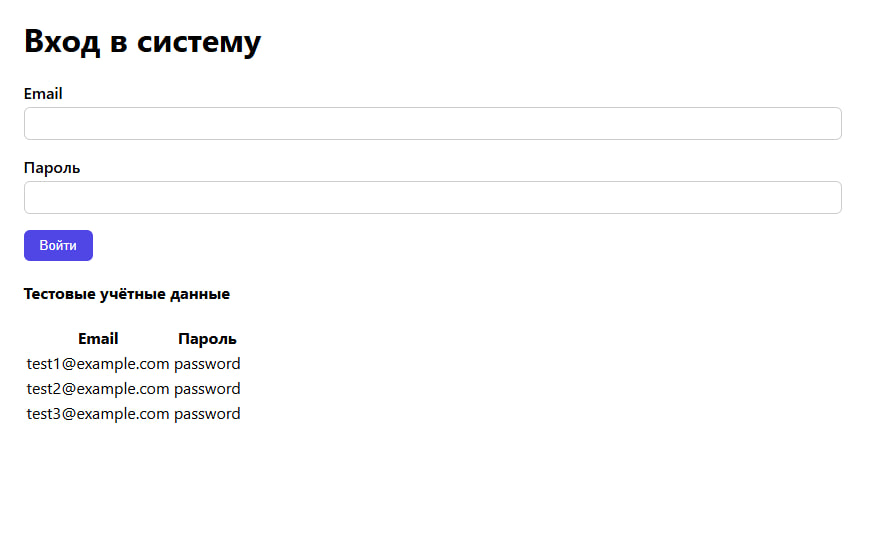
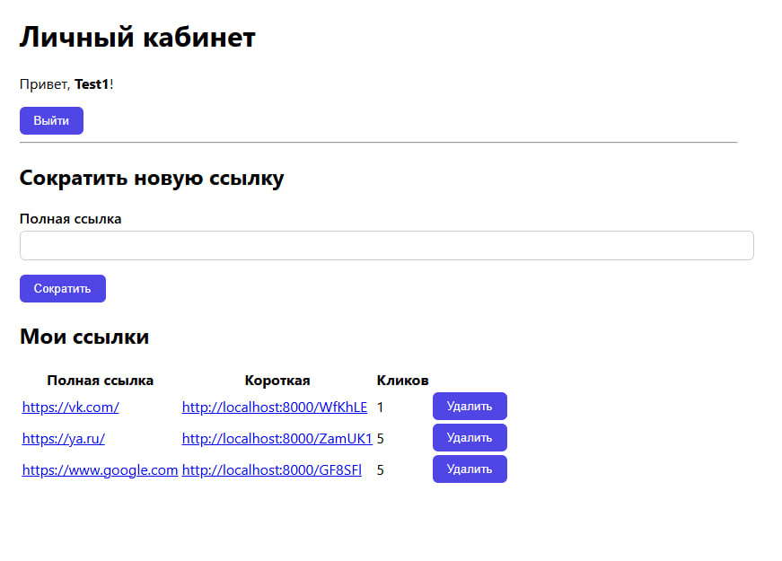
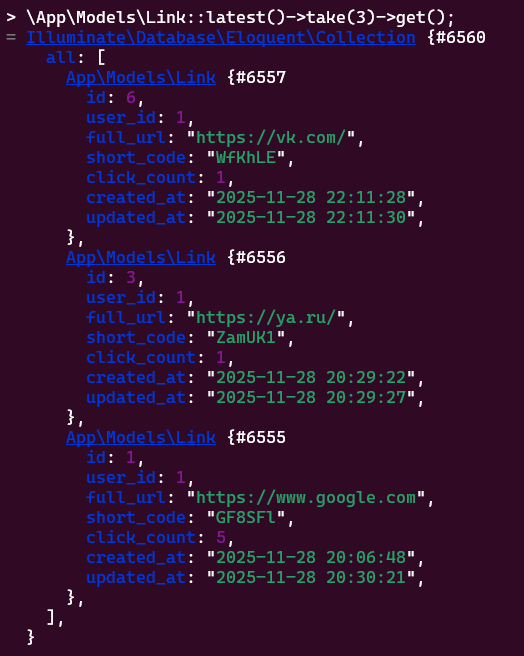
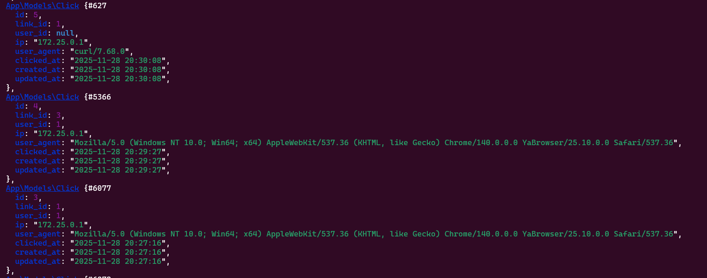
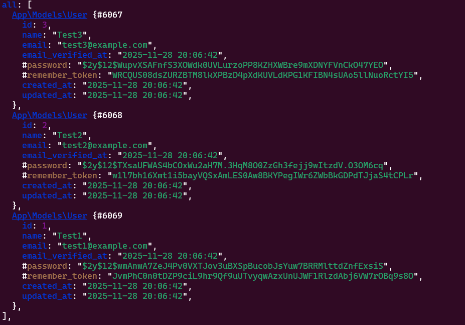

# Сокращатель ссылок (Laravel + PostgreSQL)

Тестовое задание: сокращатель ссылок с логированием и привязкой к пользователю.

## Запуск

```bash
git clone https://github.com/Mark-progg/link-shortener.git
cd link-shortener
docker-compose up -d artisan
docker-compose run --rm app php artisan migrate --seed
```

### Сервер: http://localhost:8000
### Тестовые пользователи

| Email             | Пароль     |
|-------------------|------------|
| test1@example.com | `password` |
| test2@example.com | `password` |
| test3@example.com | `password` |

Вначале нас приветсвует форма входа, с помощью нее мы можем зайти в одного из тестовых пользователей.


В меню пользователя мы можем добавить новую ссылку которую нужно сократить, посмотреть существующие ссылки у этого пользователя (оригинальный url, сокращенный, количество кликов), а также удалить такую ссылку самостоятельно, и можно выйти из текущего пользователя. 


**Внимание!** Клики могут не увеличиваться, если от одной учетной записи переходить по корткой ссылке, ввиду кэширования в бразуере,
для решения проблемы и тестирования наглядного, можно:
1. Открыть вкладку в инкогнито и еще раз перейти по ссылке, и получить еще +1 клик
2. Зайти с другого браузера
3. Вводить команду 
```bash
 curl -I http://localhost:8000/ваша-короткая-ссылка
 ```

Формат в котором сохраняются ссылки (**Link**):



Формат в котором сохраняются клики (**Click**):



Формат в котором сохраняются пользователи (**User**):



